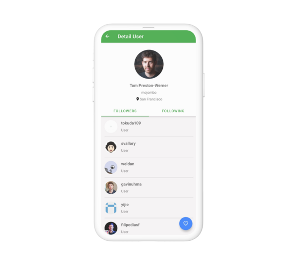

# Github User Apps
> This is repository of my submission in Dicoding class Belajar Fundamental Aplikasi Android

## Table of contents
* [Screenshots](#screenshots)
* [Technologies](#technologies)
* [Setup](#setup)
* [Features](#features)
* [Status](#status)
* [Contact](#contact)

## Screenshots
 

## Technologies
* AndroidX
* RecycleView
* LoopJ
* Glide
* SQLite

## Setup
Clone this repository and run in android studio

## Features
List of features ready and TODOs for future development
* MVVM (Model-View-ViewModel) Architecture
* Localization for support Indonesian and English Language
* SQLite for local database
* Glide for load image from url
* LoopJ to request api network

## Status
Project is: _finished_

## Contact
Created by [Adhi Setiawan](https://wwww.linkedin.com/in/adhiisetiawan) - feel free to contact me!
